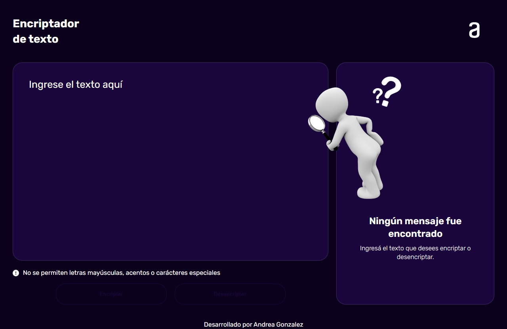

#🔑 Encriptador de texto

Esta aplicacion corresponde con el primer challenge de Alura Latam & Oracle Next Education. Está desarrollado con html, css y javaScript. Su función es encriptar y desencriptar mensajes segun un conjunto de llaves de encriptacion. El objetivo de esta aplicacion es intercambiar información con otras personas de una manera segura e intuitiva.

## Interfaz de usuario: 

## 🔗Links

Pagina : [Github-Pages](https://andreahebegonzalez.github.io/encriptador-ag/)

## 🔑Llaves de encriptacion

Las "llaves" de encriptación que se utilizaron son las siguiente:

- La letra **"e"** es convertida para **"enter"**
- La letra **"i"** es convertida para **"imes"**
- La letra **"a"** es convertida para **"ai"**
- La letra **"o"** es convertida para **"ober"**
- La letra **"u"** es convertida para **"ufat"**

**Aplica también a la inversa**

## 📋Requisitos:

- Debe funcionar solo con letras minúsculas.
- No deben ser utilizados letras con acentos ni caracteres especiales.
- Hay un botón que copia el texto encriptado/desencriptado y un icono de pegar que facilita el pegado del texto presente en el portapapeles del sistema en el campo de entrada de texto.
- Debe ser posible convertir una palabra para la versión encriptada también devolver una palabra encriptada para su versión original.
- Para que una palabra pueda desencriptarse debe estar completamente encriptada segun las llaves de encriptacion.
- Solo se encriptan palabras, un conjunto de letras que contienen solo consonantes devolverá error.
- La interfaz contiene un campo que recibe el texto a encriptar o desencriptar.
- El resultado se muestra en el panel derecho.

` Por ejemplo: "gato" => "gaitober" "gaitober" => "gato"`

### autora

Andrea Gonzalez 
 